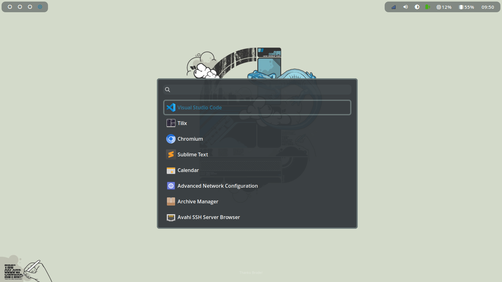

Waymenu is a launcher/menu program for wlroots based compositors written in
Rust using GTK v4. It supports listing/launching applications from `.desktop`
files, or creating a menu with your own entries for scripting purposes.



## Dependencies

* gtk4
* [gtk4-layer-shell](https://github.com/wmww/gtk4-layer-shell)
  [AUR](https://aur.archlinux.org/packages/gtk4-layer-shell)

## Install

Assuming you have `~/.local/bin` in your `$PATH`, use cargo to build and copy
the executable to your local bin directory.

    cargo install --path . --root ~/.local

## Slow Startup

On my old ThinkPad x1 Carbon there is ~400ms delay in starting waymenu.

Turns out this affects other GTK4 apps.
https://gitlab.gnome.org/GNOME/gtk/-/issues/4112

There is an upstream issue tracking this in the mesa projects.
https://gitlab.freedesktop.org/mesa/mesa/-/issues/5113

Workaround is to use the cairo renderer.

    GSK_RENDERER=cairo waymenu launcher

## Styling

Waymenu style is fully customizable using CSS.

The default location of the stylesheet is `$XDG_CONFIG_HOME/waymenu/style.css`.
Use `waymenu init-config` to save the default stylesheet as a starting point.

The widget hierarchy is as follows:

```
window#window
|_ box#window-box
   |_ entry#search
   |_ scrollwindow#scroll
      |_ listview#list
         |_ row
            |_ box
               |_ image
               |_ label
```

The GTK debugger can be helpful for inspecting widgets and making CSS changes
while the app is running.

    GTK_DEBUG=interactive waymenu launcher
