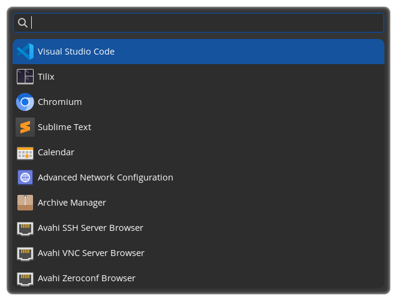
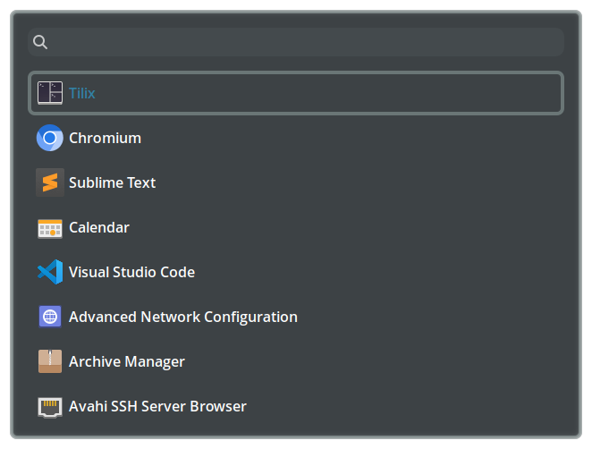
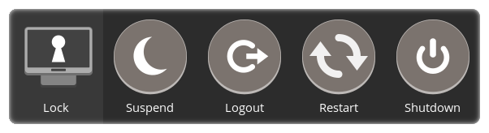

+++
title = "Examples"
+++

## Default



_Out of the box_ look and feel with the default GTK Adwaita theme.

---

## Styled



Waymenu styled using colours from a shared pallet. Built with `sassc`.

    sassc style.scss ~/.config/waybar/style.css

```scss
// @import '../_pallet.scss';
$pallet1: #636F6F;
$pallet3: #287BA1;
$pallet7: #33393C;

$border: 4px;
$radius: 8px;
$main-padding: 16px;
$border-color: $pallet1;
$background-color: $pallet7;
$entry-text: white;
$selected-color: transparent;
$selected-border: $pallet1;
$selected-text: $pallet3;

* {
    font-family: 'Open Sans';
    font-weight: 600;
    font-size: 16px;
    outline-style: none;
}

#window {
    border-radius: $radius;
    border: $border solid $border-color;
    background-color: $background-color;
    padding: $main-padding;
    // this causes weird alpha bugs when using GSK_RENDERER=gl (the default for GTK4)
    opacity: 0.95;
}

#search {
    margin-bottom: $main-padding;
}

#list {
    background-color: transparent;

    row {
        border-radius: $radius;

        // invisible border so selected/unselected entries have same size
        border: $border solid transparent;
        color: $entry-text;

        &:selected {
            border: $border solid $selected-border;
            background-color: $selected-color;

            label {
                color: $selected-text;
            }
        }

        image {
            padding: $main-padding / 3;
        }
    }
}
```

---

## Custom menu



Custom menu with "Power" related actions.

```bash
# using WAYMENU_HOME set to dir with `config.jsonc` and `style.css`
# OR you could pass -c and -s arguments
WAYMENU_HOME=~/.config/waymenu/power waymenu menu menu.json
```

`menu.json`
```json
[
    {
        "label": "Lock",
        "icon": "/usr/share/icons/Pop/128x128/actions/system-lock-screen.svg",
        "exec": ["swaylock", "-f", "-e"]
    },
    {
        "label": "Suspend",
        "icon": "/usr/share/icons/Pop/128x128/actions/system-suspend.svg",
        "exec": ["systemctl", "suspend"]
    },
    {
        "label": "Logout",
        "icon": "/usr/share/icons/Pop/128x128/actions/system-log-out.svg",
        "exec": ["hyprctl", "dispatch", "exit"]
    },
    {
        "label": "Restart",
        "icon": "/usr/share/icons/Pop/128x128/actions/system-restart.svg",
        "exec": ["systemctl", "reboot"]
    },
    {
        "label": "Shutdown",
        "icon": "/usr/share/icons/Pop/128x128/actions/system-shutdown.svg",
        "exec": ["systemctl", "poweroff"]
    }
]
```

`~/.config/waymenu/power/style.css`
```css
#window {
    border-radius: 10px;
}

#list row {
    padding: 10px;
}

#list row image {
    -gtk-icon-size: 96px;
    padding-bottom: 5px;
}
```

`~/.config/waymenu/power/config.jsonc`
```json
{
    "width": 580,
    "height": 142,
    "orientation": "horizontal",
    "hide_search": true
}
```